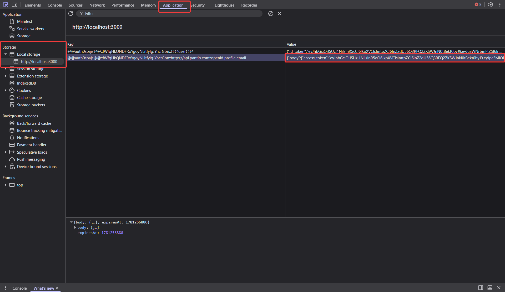
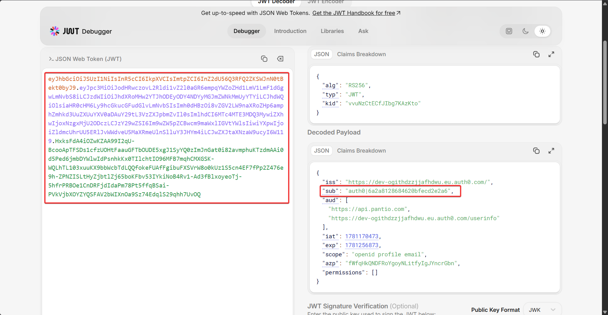

# Pantio

Pantio is a household inventory and food management app. It lets users track pantry items and expiry dates, manage shopping lists, get AI-powered recipe suggestions, and sync receipts from Netto+ automatically.

**Stack:** ASP.NET Core 10 (backend) · Vue + Vite (frontend) · PostgreSQL · Redis · Auth0

---

## Try it out

A live version of the app is running in production.

**[https://pantio.thisisalegitwebsite.qzz.io/](https://pantio.thisisalegitwebsite.qzz.io/)**

---

## Running locally

All commands are run from the repo root.

---

## Prerequisites

- [Docker Desktop](https://www.docker.com/products/docker-desktop/)

---

### 1. Get the environment file

The `.env.dev` file is gitignored. Download it from:

```
https://fileshare.navisystems.dpdns.org/s/Dev-Env/dev-env-pantio.zip
```

Password: `pantio`

Place it in the **repo root** (next to `docker-compose.yml`).

---

### 2. Start all services

```powershell
docker compose --env-file .env.dev -f docker-compose.yml -f docker-compose.dev.yml up -d
```

This starts:
- `backend` — ASP.NET Core API at `http://localhost:5000`
- `frontend` — Vue SPA served by nginx at `http://localhost:3000`
- `postgres` — PostgreSQL at `localhost:5432`
- `redis` — Redis at `localhost:6379`

Database migrations run automatically on backend startup.

---

## First-time user setup

After starting the stack, you need to register your user in the database. There are two ways to do this.

### Option A — via API request

1. Open the frontend at `http://localhost:3000` and log in via Auth0. Create an account if you haven't done so.
2. Open DevTools → Application → Local Storage → find the access token key starting with `@@auth0spajs@@` and copy the `access_token` value



3. Decode the token at [jwt.io](https://jwt.io) and note the `sub` claim (e.g. `auth0|6a2a769797fd458635ba1b9c`)



4. Send a `POST` request to `http://localhost:5000/api/users/ensure` with the following JSON body and an `Authorization: Bearer <your_access_token>` header. Use any HTTP client you prefer (curl, Postman, Insomnia, Bruno, etc.):

```json
{
  "email": "your@email.com",
  "auth0Sub": "auth0|xxxxxxxxxxxxxxxx"
}
```

A successful response returns the created user object with an `id` field.

### Option B — directly in the database

Connect to the PostgreSQL container with any database client (e.g. [pgAdmin](https://www.pgadmin.org/), [DBeaver](https://dbeaver.io/), [TablePlus](https://tableplus.com/)):

| Field | Value |
|---|---|
| Host | `localhost` |
| Port | `5432` |
| Database | `pantio_dev` |
| Username | `pantio` |
| Password | `pantio_dev_pass` |

After signing up, a user row already exists but has no `auth0_sub`, update it:

```sql
UPDATE users
SET auth0_sub = 'auth0|xxxxxxxxxxxxxxxx'
WHERE email = 'your@email.com';
```

Replace `auth0|xxxxxxxxxxxxxxxx` with your `sub` claim from jwt.io.

