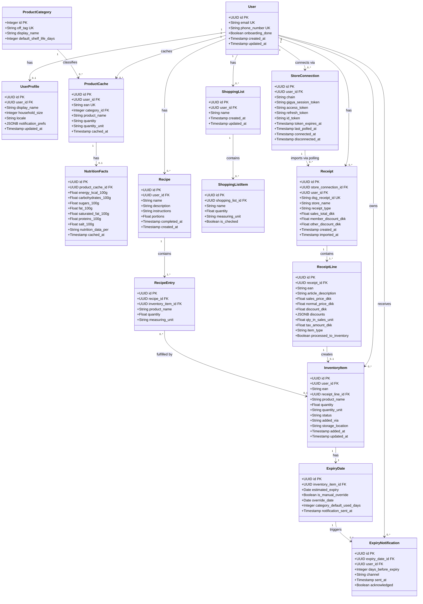

# Domain Model — MVP

## Context boundaries

| Context | Aggregates | Notes |
|---|---|---|
| User | `User`, `UserProfile` | Auth identity, preferences, onboarding state |
| Product catalogue | `ProductCache`, `NutritionFacts`, `ProductCategory` | No Product mirror. Thin per-user OFF cache. `InventoryItem` snapshots name and unit at add time. |
| Inventory | `InventoryItem`, `ExpiryDate`, `ExpiryNotification` | Core domain. Expiry estimated from `ProductCategory.default_shelf_life_days`. |
| Supermarket integration | `StoreConnection`, `Receipt`, `ReceiptLine` | DSG Club API (`p-club.dsgapps.dk`). OAuth via Gigya + PKCE, `customer-program` client. |
| Shopping list | `ShoppingList`, `ShoppingListItem` | Free-text entries in MVP. No direct link to `RecipeEntry` — fulfilled via name matching. |
| Recipe | `Recipe`, `RecipeEntry` | AI-suggested. Lifecycle driven by `RecipeEntry.inventory_item_id` nullability. |

## Key domain rules

- No `Product` table. OFF is the source of truth. `ProductCache` is a thin per-user cache — evictable at any time.
- `InventoryItem` snapshots `product_name`, `quantity`, and `quantity_unit` at add time. These survive cache eviction and OFF outages.
- `ProductCategory.off_tag` maps to an entry in `categories_tags[]` from the OFF response. Resolved once at cache time.
- `ExpiryDate.estimated_expiry` = `InventoryItem.added_at + ProductCategory.default_shelf_life_days`.
- `NutritionFacts` is 1:0..1 with `ProductCache`. All values are per-100g/100ml as returned by OFF.
- Polling: `GET /api/cp/receipt` → diff against known `dsg_receipt_id` values → call `GET /api/cp/receipt/details?type=merged&receiptId={id}` for new IDs.
- `ReceiptLine.item_type` `01` = product, `02` = deposit/pant. Only `01` lines are processed to inventory.
- `ReceiptLine.processed_to_inventory` prevents duplicate `InventoryItem` creation on re-poll.
- All monetary values from the Club API are in **DKK**. Stored as `FLOAT` matching the API.
- `StoreConnection` token refresh uses `client_id=customer-program` — never `scan-and-go-native`.
- `InventoryItem.added_via` enum: `receipt`, `barcode`, `manual`.
- `InventoryItem.status` enum: `available`, `low`, `expired`, `consumed`.

## Recipe lifecycle

1. AI suggests a recipe → `Recipe` + `RecipeEntry` rows created. `inventory_item_id` set where inventory items exist, `NULL` where ingredients are missing.
2. Missing entries (`inventory_item_id IS NULL`) → a `ShoppingListItem` is created per missing `RecipeEntry` using `RecipeEntry.product_name` as the item name.
3. User purchases item → `InventoryItem` created → matcher runs case-insensitive comparison of `InventoryItem.product_name` against all `RecipeEntry.product_name` where `inventory_item_id IS NULL` for that user. On match: `RecipeEntry.inventory_item_id` set, corresponding `ShoppingListItem` deleted.
4. All `RecipeEntry` rows for a recipe have `inventory_item_id` set → recipe is actionable.
5. User marks recipe complete → `Recipe.completed_at` set, `InventoryItem.quantity` decremented per `RecipeEntry` via `inventory_item_id`.
